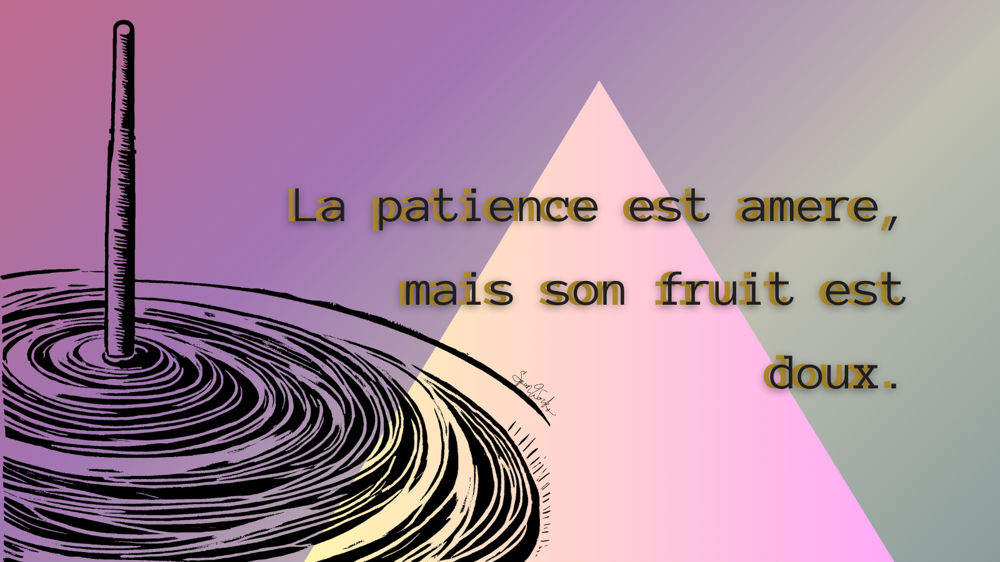

<!DOCTYPE html>
<html>
<head>

</head>
<body>

<h2>The text-align Property</h2>
<h2>L. Ribaudo</h2>

<b> Summary </b>

Detail oriented and results driven engineer with extensive teaching experience offers a mature perspective, a deep commitment to continuous learning, and ability to solve problems creatively by drawing from experience in diverse sectors.
     

<b>  Skills and Certifications</b>

Six Sigma Black Belt • SQL, R, GIS, Microsoft Suite & online collaboration • Experience with Python, Javascript    Working knowledge French, Spanish

<b> Experience</b>

<table>
  <tr>
  <td style="border: 0px solid red;text-align:right;width:50%;vertical-align:top;">4/24-11/24</td>
  <td style="border: 0px solid red;text-align:right;vertical-align:top;"><b>Catalyst/Materials Engineer </b>
		 <i>FuelCell Energy, Danbury, CT </i>
    • Assisted research aimed at developing new steam reforming catalysts through data analysis and lab work. 
    • Implemented data management system for current and historical test data and improved data accessibility through R-Shiny dashboard. 
      </td>
</table>

  

  

    
Nothing here yet

  

         

        

         

          

         

        

   

Contact:Lisa.Ribaudo@gmail.com

 

  </body>
  </head>
  </html>
